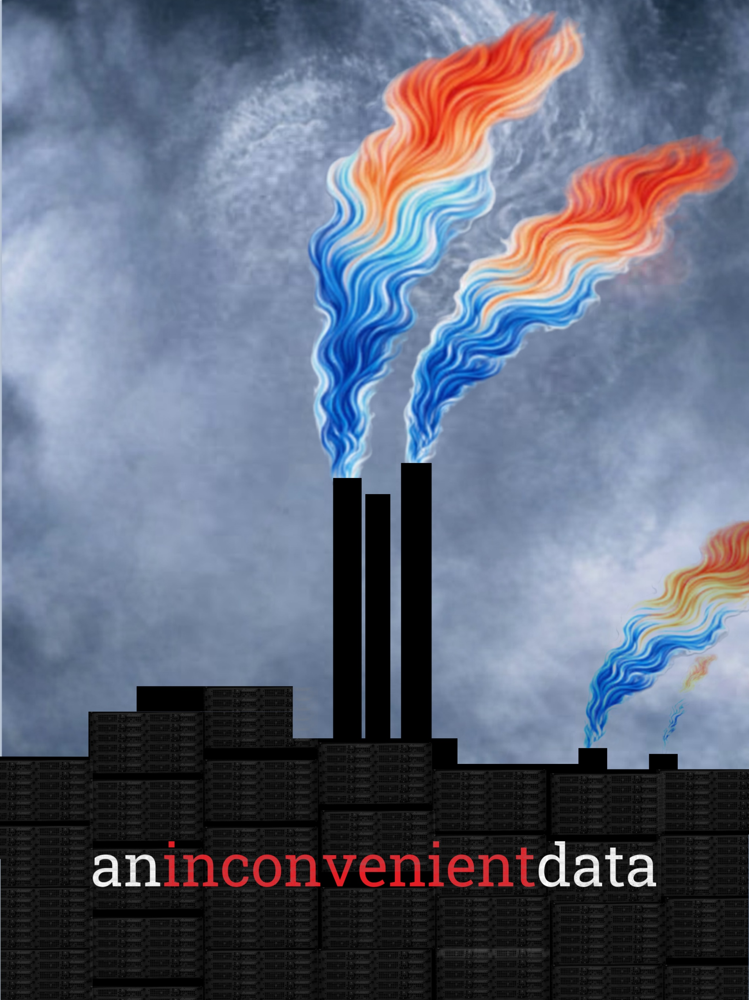
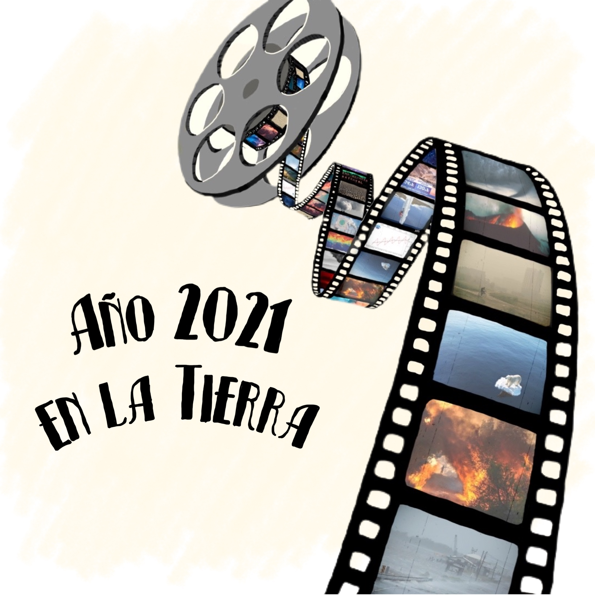

```{=html}
<div class="visuals-intro">
  <p>Where climate science meets <del>Adobe Illustrator</del> visual storytelling.</p>
</div>

<div class="art-list">

  <div class="art-item">
    
    <div class="art-text">
      <p class="art-title">an inconvenient data</p>
      <p class="art-desc"><em>An Inconvenient Truth</em> was one of the first climate films I watched, and one of the most striking. Released in 2006, it turned Al Gore's slideshow into a cultural moment, bringing the science of global warming to a mainstream audience long before climate communication became a field of its own.</p>
      <p class="art-desc">The poster stayed with me. So I made my own version: the factory chimneys from the original poster replaced by racks of an HPC cluster. The smoke rising from them is no longer industrial pollution, but the Ed Hawkins' Climate Stripes: blue fading into red, decade by decade. Same image, different source. Same story.</p>
    </div>
  </div>


<div class="art-item">
  
  <div class="art-text">
    <p class="art-title">año 2021 en la tierra</p>
    <p class="art-desc"><em>One Day on Earth</em> is a documentary project that captures a single day on the planet through thousands of simultaneous recordings. I took that idea and made it my own: a film reel, but instead of one day, the entire 2021, told through images of climate events.</p>
    <p class="art-desc">The title is in Spanish <em>Año 2021 en la Tierra</em> meaning Year 2021 on Earth. What's in the frames does: a polar bear stranded on shrinking ice, wildfires tearing through landscapes across three continents, smoke where there used to be sky. Each frame a document. Each year that year.</p>
  </div>
</div>


</div>

<!-- Lightbox -->
<div class="art-lb" id="art-lb" onclick="closeLb()">
  <button class="art-lb-close" onclick="closeLb()">✕</button>
  
</div>

<style>
.visuals-intro {
  text-align: center;
  margin: 2rem 0 2.5rem 0;
  color: #555;
  font-size: 1.05rem;
}

.art-list {
  display: flex;
  flex-direction: column;
  gap: 3.5rem;
  max-width: 680px;
  margin: 0 auto;
  padding: 0 1rem 4rem 1rem;
}

.art-item {
  display: flex;
  flex-direction: column;
  align-items: center;
}

.art-img {
  width: 100%;
  height: auto;
  display: block;
  border-radius: 8px;
  box-shadow: none;
  cursor: zoom-in;
  transition: opacity 0.2s;
}

.art-img:hover { opacity: 0.88; }

.art-img-sm {
  max-height: 500px;
  object-fit: contain;
}

.art-text {
  width: 100%;
  padding: 1rem 0.2rem 0 0.2rem;
}

.art-title {
  font-size: 0.72rem;
  font-weight: 600;
  letter-spacing: 0.14em;
  text-transform: uppercase;
  color: #aaa;
  margin: 0 0 0.4rem 0;
}

.art-desc {
  font-size: 0.92rem;
  color: #555;
  line-height: 1.65;
  font-style: italic;
  margin: 0 0 0.6rem 0;
}

/* ── Lightbox ─────────────────────────────────────────── */
.art-lb {
  display: none;
  position: fixed;
  inset: 0;
  background: rgba(0,0,0,0.88);
  z-index: 9999;
  justify-content: center;
  align-items: center;
  cursor: zoom-out;
}

.art-lb.active { display: flex; }

.art-lb img {
  max-width: 92vw;
  max-height: 90vh;
  object-fit: contain;
  border-radius: 6px;
  box-shadow: 0 8px 48px rgba(0,0,0,0.6);
  animation: lbIn 0.22s ease;
}

.art-lb-close {
  position: fixed;
  top: 1.2rem;
  right: 1.5rem;
  background: none;
  border: none;
  color: #fff;
  font-size: 1.6rem;
  cursor: pointer;
  opacity: 0.7;
  transition: opacity 0.2s;
  z-index: 2;
}

.art-lb-close:hover { opacity: 1; }

@keyframes lbIn {
  from { opacity: 0; transform: scale(0.96); }
  to   { opacity: 1; transform: scale(1); }
}
</style>

<script>
function openLb(img) {
  document.getElementById('art-lb-img').src = img.src;
  document.getElementById('art-lb-img').alt = img.alt;
  document.getElementById('art-lb').classList.add('active');
  document.body.style.overflow = 'hidden';
}

function closeLb() {
  document.getElementById('art-lb').classList.remove('active');
  document.body.style.overflow = '';
}

document.addEventListener('keydown', e => {
  if (e.key === 'Escape') closeLb();
});
</script>
```
