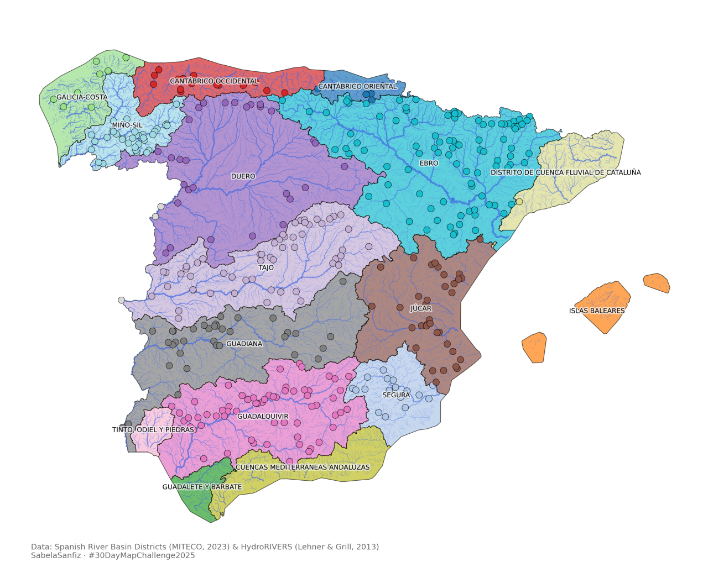

```{=html}
<div class="visuals-intro">
  <p>
    [Under Construction] Some maps, charts and animations made with Python
  </p>
</div>

<div class="visuals-grid">

  <a href="visuals/plot1.html" class="visual-card">
    
    <p class="visual-caption">Weather station coverage across Spain · #30DayMapChallenge</p>
  </a>

  <a href="visuals/plot2.html" class="visual-card">
    
    <p class="visual-caption">Spanish river basin districts with HydroRIVERS · #30DayMapChallenge</p>
  </a>

  <a href="visuals/rivers-europe.html" class="visual-card">
    
    <p class="visual-caption">European rivers — minimal map · #30DayMapChallenge</p>
  </a>

  <a href="visuals/co2-seaice.html" class="visual-card">
    <video class="visual-img" autoplay loop muted playsinline>
      <source src="images/visuals/co2-seaice.mp4" type="video/mp4"/>
    </video>
    <p class="visual-caption">CO₂ and sea ice extent — animated time series</p>
  </a>

</div>

<style>
.visuals-intro {
  text-align: center;
  margin: 2rem 0 2.5rem 0;
  color: #555;
  font-size: 1.05rem;
}
.visuals-grid {
  display: grid;
  grid-template-columns: repeat(auto-fill, minmax(300px, 1fr));
  gap: 1.8rem;
  padding: 0 1rem 3rem 1rem;
}
.visual-card {
  display: flex;
  flex-direction: column;
  border-radius: 10px;
  overflow: hidden;
  box-shadow: 0 4px 16px rgba(0,0,0,0.10);
  background: #fff;
  text-decoration: none;
  color: inherit;
  transition: transform 0.2s ease, box-shadow 0.2s ease;
}
.visual-card:hover {
  transform: translateY(-4px);
  box-shadow: 0 10px 28px rgba(0,0,0,0.15);
}
.visual-img {
  width: 100%;
  aspect-ratio: 4 / 3;
  object-fit: cover;
  display: block;
}
.visual-caption {
  padding: 0.7rem 1rem;
  font-size: 0.85rem;
  color: #555;
  line-height: 1.4;
  margin: 0;
}

.python-logo {
  width: 48px;
  height: 48px;
  object-fit: contain;
  vertical-align: middle;
  margin-left: 6px;
  border-radius: 4px;
}
</style>
```
