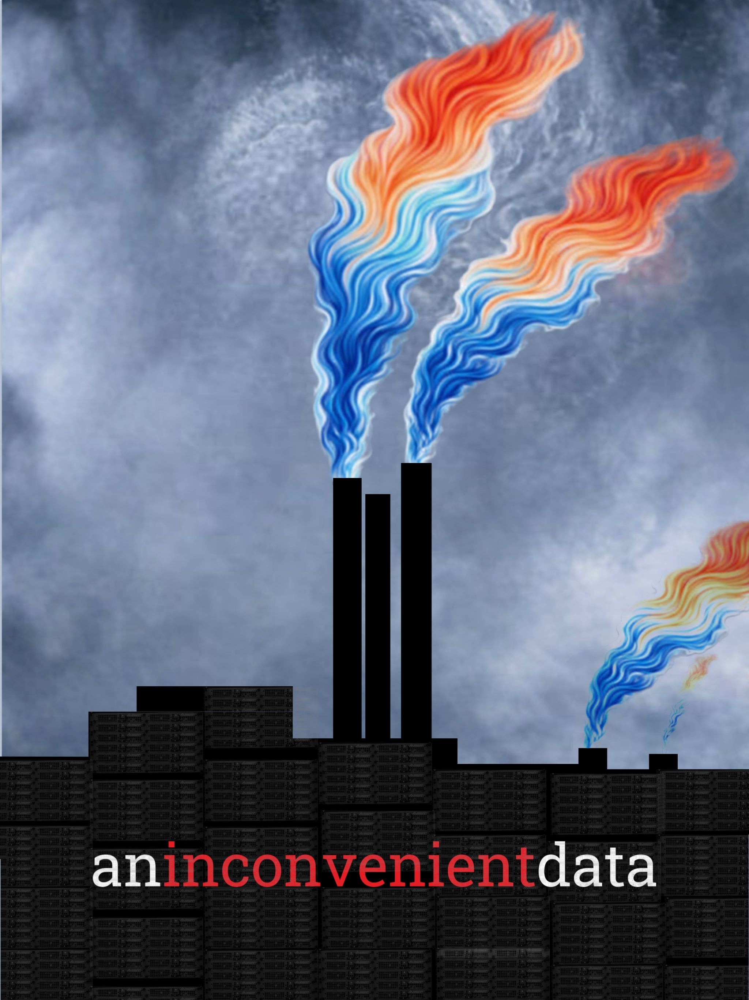
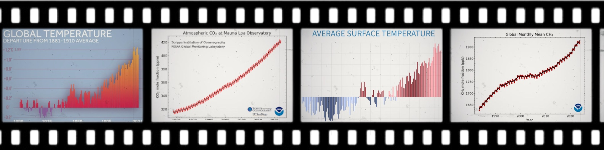
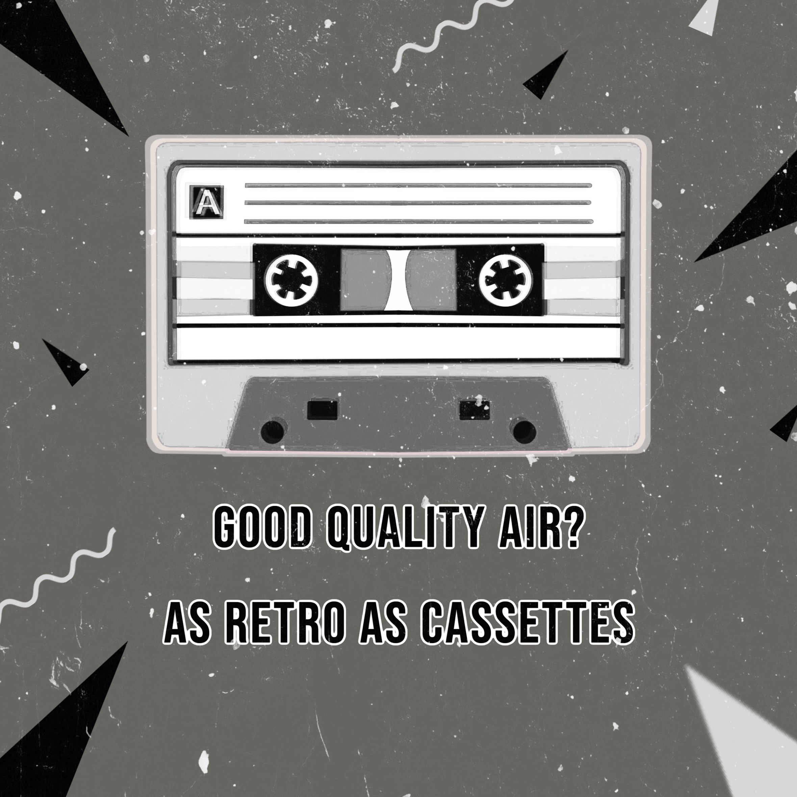

```{=html}
<div class="art-intro">
  <p>Where climate science meets <del>Adobe Illustrator</del> visual storytelling.</p>
</div>

<div class="poster-wall">

  <div class="poster" style="--r: -3deg; --tx: 0px; --ty: 10px;" onclick="openLightbox(this)">
    <div class="pin"></div>
    
    <p class="poster-title">an inconvenient data</p>
  </div>

  <div class="poster" style="--r: 2deg; --tx: 5px; --ty: 0px;" onclick="openLightbox(this)">
    <div class="pin"></div>
    
    <p class="poster-title">climate data, cinematic cut</p>
  </div>

  <div class="poster" style="--r: -1.5deg; --tx: -5px; --ty: 15px;" onclick="openLightbox(this)">
    <div class="pin"></div>
    
    <p class="poster-title">good quality air? as retro as cassettes</p>
  </div>

  <div class="poster" style="--r: 3.5deg; --tx: 8px; --ty: 5px;" onclick="openLightbox(this)">
    <div class="pin"></div>
    
    <p class="poster-title">there is no planet b</p>
  </div>

</div>

<!-- Lightbox -->
<div class="lb-overlay" id="lb-overlay" onclick="closeLightbox()">
  <button class="lb-close" onclick="closeLightbox()">✕</button>
  
  <p class="lb-caption" id="lb-caption"></p>
</div>

<style>

.art-intro {
  text-align: center;
  font-family: Georgia, serif;
  font-size: 1.1rem;
  color: #555;
  margin: 2rem 0 3rem 0;
  letter-spacing: 0.04em;
}

.poster-wall {
  display: flex;
  flex-wrap: wrap;
  justify-content: center;
  align-items: flex-start;
  gap: 3rem 2.5rem;
  padding: 1rem 2rem 5rem 2rem;
}

.poster {
  position: relative;
  width: 220px;
  background: #fff;
  padding: 10px 10px 40px 10px;
  box-shadow:
    2px 2px 4px rgba(0,0,0,0.10),
    6px 8px 20px rgba(0,0,0,0.18);
  transform: rotate(var(--r)) translate(var(--tx), var(--ty));
  transition: transform 0.35s cubic-bezier(.22,.68,0,1.2),
              box-shadow 0.35s ease;
  cursor: pointer;
}

.poster:hover {
  transform: rotate(0deg) translate(0, -8px) scale(1.04);
  box-shadow:
    4px 4px 8px rgba(0,0,0,0.12),
    12px 18px 36px rgba(0,0,0,0.22);
  z-index: 10;
}

.pin {
  position: absolute;
  top: -10px;
  left: 50%;
  transform: translateX(-50%);
  width: 14px;
  height: 14px;
  background: radial-gradient(circle at 40% 35%, #f5c842, #c8960a);
  border-radius: 50%;
  box-shadow: 0 2px 4px rgba(0,0,0,0.35);
  z-index: 2;
}

.pin::after {
  content: '';
  position: absolute;
  bottom: -6px;
  left: 50%;
  transform: translateX(-50%);
  width: 2px;
  height: 8px;
  background: #aaa;
  border-radius: 1px;
}

.poster img {
  width: 100%;
  display: block;
  object-fit: cover;
  aspect-ratio: 3/4;
}

.poster-title {
  font-family: 'Brush Script MT', cursive;
  font-size: 1.05rem;
  color: #333;
  text-align: center;
  margin: 8px 0 0 0;
  line-height: 1.3;
  letter-spacing: 0.02em;
}

/* ── Lightbox ── */
.lb-overlay {
  display: none;
  position: fixed;
  inset: 0;
  background: rgba(0,0,0,0.88);
  z-index: 9999;
  justify-content: center;
  align-items: center;
  flex-direction: column;
  padding: 2rem;
  cursor: zoom-out;
}

.lb-overlay.active {
  display: flex;
}

.lb-img {
  max-width: 90vw;
  max-height: 82vh;
  object-fit: contain;
  border-radius: 4px;
  box-shadow: 0 8px 48px rgba(0,0,0,0.6);
  animation: lbFadeIn 0.25s ease;
}

.lb-caption {
  font-family: 'Brush Script MT', cursive;
  font-size: 1.3rem;
  color: #e8d8b0;
  margin-top: 1rem;
  letter-spacing: 0.03em;
}

.lb-close {
  position: fixed;
  top: 1.2rem;
  right: 1.5rem;
  background: none;
  border: none;
  color: #fff;
  font-size: 1.6rem;
  cursor: pointer;
  opacity: 0.7;
  transition: opacity 0.2s;
  line-height: 1;
}

.lb-close:hover {
  opacity: 1;
}

@keyframes lbFadeIn {
  from { opacity: 0; transform: scale(0.95); }
  to   { opacity: 1; transform: scale(1); }
}
</style>

<script>
function openLightbox(poster) {
  const img = poster.querySelector('img');
  const title = poster.querySelector('.poster-title');
  document.getElementById('lb-img').src = img.src;
  document.getElementById('lb-img').alt = img.alt;
  document.getElementById('lb-caption').textContent = title.textContent;
  document.getElementById('lb-overlay').classList.add('active');
  document.body.style.overflow = 'hidden';
}

function closeLightbox() {
  document.getElementById('lb-overlay').classList.remove('active');
  document.body.style.overflow = '';
}

document.addEventListener('keydown', function(e) {
  if (e.key === 'Escape') closeLightbox();
});
</script>
```
