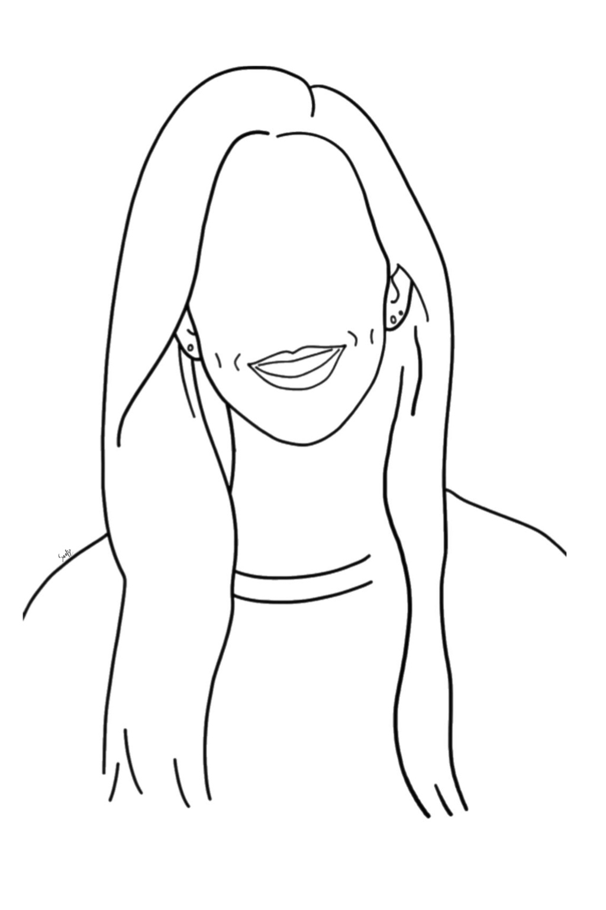
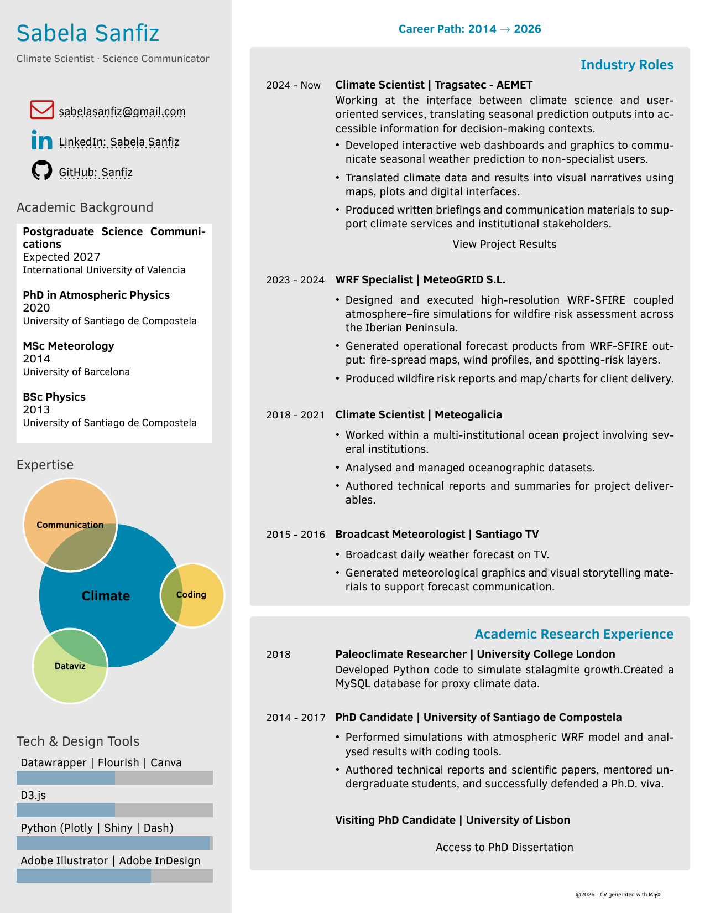
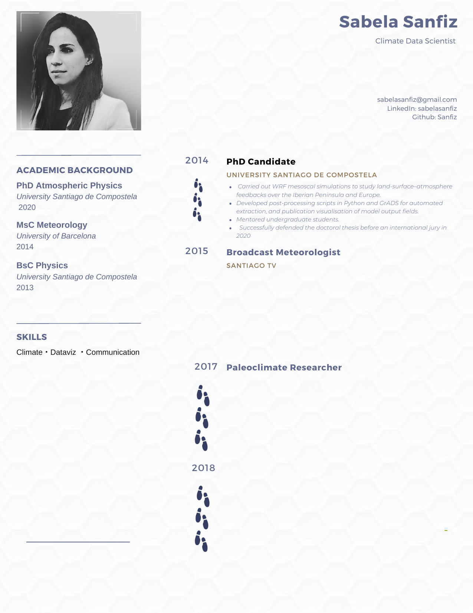

```{=html}
<div class="dashboard">

  <!-- INTRO -->
  <div class="widget widget-intro">
    <div class="widget-header">
      <span class="widget-label">// profile.txt</span>
      <span class="widget-dot red"></span>
      <span class="widget-dot yellow"></span>
      <span class="widget-dot green"></span>
    </div>
    <div class="widget-body intro-body">

      <div class="flip-card" onclick="this.classList.toggle('is-flipped')">
        <div class="flip-card-inner">
          <div class="flip-card-front">
            
          </div>
          <div class="flip-card-back">
            <div class="flip-card-back-content">
              <h3>Self-Portrait</h3>
              <p>Created in Adobe Illustrator using an iPad.</p>
            </div>
          </div>
        </div>
      </div>

      <div class="intro-text">
        <p class="dash-hi">Hi, I'm <strong>Sabela Sanfiz</strong>.</p>
        <p class="dash-text">I am a <strong>Climate Scientist</strong> with over ten years of experience working with climate data, building visualisation products and communicating science in a meaningful way.</p>
        <p class="dash-text">My career has taken me from pure research to interactive dashboards and communication materials. That intersection — between pure science and climate storytelling — is where I am happy to be.</p>
        <p class="dash-italic"><em>Where does my work sit?</em> Somewhere between climate science and narrative. A challenging space, but a necessary one.</p>
      </div>

    </div>
  </div>

  <!-- STATS -->
  <div class="widget widget-metrics">
    <div class="widget-header">
      <span class="widget-label">// stats.csv</span>
      <span class="widget-dot red"></span>
      <span class="widget-dot yellow"></span>
      <span class="widget-dot green"></span>
    </div>
    <div class="metrics-grid">
      <div class="metric">
        <span class="metric-value">10+</span>
        <span class="metric-label">years in climate science</span>
      </div>
      <div class="metric">
        <span class="metric-value">4</span>
        <span class="metric-label">countries worked in</span>
      </div>
      <div class="metric">
        <span class="metric-value">1 PhD</span>
        <span class="metric-label">in Climate</span>
      </div>
      <div class="metric">
        <span class="metric-value" style="font-size: 2.4rem;">∞</span>
        <span class="metric-label">coffees consumed</span>
      </div>
    </div>
  </div>

  <!-- CAREER -->
  <div class="widget widget-full">
    <div class="widget-header">
      <span class="widget-label">// career.log</span>
      <span class="widget-dot red"></span>
      <span class="widget-dot yellow"></span>
      <span class="widget-dot green"></span>
    </div>
    <div class="widget-body one-box">

      <p class="one-tagline">Online version or download it. Your call.</p>

      <div class="one-options">

        <a href="cv-career.html" class="one-card one-card-online">
          
          <p class="one-card-title">Browse my CV</p>
          <p class="one-card-sub">Studies · Positions · Skills</p>
          <p class="one-cta">→ open</p>
        </a>

        <div class="one-or">or</div>

        <div class="one-downloads">
          <p class="one-card-title">Download a PDF version</p>
          <div class="one-pdfs">
            <a href="cv-latex.pdf" download="cv-latex.pdf" class="cv-dl-card">
              
              <span class="cv-dl-name">LaTeX</span>
              <span class="cv-dl-hint">↓ download</span>
            </a>
            <a href="cv-canva.pdf" download="CV_Sabela_Sanfiz_Canva.pdf" class="cv-dl-card">
              
              <span class="cv-dl-name">Canva</span>
              <span class="cv-dl-hint">↓ download</span>
            </a>
          </div>
        </div>

      </div>
    </div>
  </div>

</div>

<style>
.dashboard {
  display: grid;
  grid-template-columns: 1fr 1fr;
  gap: 1.2rem;
  max-width: 860px;
  margin: 2rem auto 3rem auto;
  padding: 0 1rem;
}

.widget {
  background: rgba(255,255,255,0.82);
  border: 1px solid var(--softgray);
  border-radius: 12px;
  overflow: hidden;
  box-shadow: 0 2px 12px rgba(0,0,0,0.06);
  text-decoration: none;
  color: inherit;
  transition: transform 0.2s ease, box-shadow 0.2s ease;
}

.widget-header {
  background: color-mix(in srgb, var(--softgray) 30%, white);
  padding: 6px 12px;
  display: flex;
  align-items: center;
  gap: 6px;
  border-bottom: 1px solid var(--softgray);
}

.widget-label {
  font-family: monospace;
  font-size: 0.65rem;
  color: var(--vanilla);
  flex: 1;
  letter-spacing: 0.03em;
}

.widget-dot { width: 9px; height: 9px; border-radius: 50%; }
.widget-dot.red    { background: #ff5f57; }
.widget-dot.yellow { background: #febc2e; }
.widget-dot.green  { background: #28c840; }

.widget-body { padding: 1.2rem 1.4rem; }

.widget-intro   { grid-column: 1 / 3; }
.widget-metrics { grid-column: 1 / 3; }
.widget-full    { grid-column: 1 / 3; }

.dash-hi {
  font-size: 1.2rem;
  font-weight: 500;
  color: #1a1a1a;
  margin-bottom: 0.8rem;
}
.dash-text {
  font-size: 0.9rem;
  line-height: 1.7;
  color: #444;
  margin-bottom: 0.6rem;
  text-align: justify;
}
.dash-italic {
  font-size: 0.88rem;
  color: #777;
  font-style: italic;
}

.metrics-grid {
  display: grid;
  grid-template-columns: repeat(4, 1fr);
  gap: 0.8rem;
  padding: 1rem 1.4rem 1.2rem;
}
.metric {
  display: flex;
  flex-direction: column;
  align-items: center;
  text-align: center;
  padding: 0.8rem 0.5rem;
  background: color-mix(in srgb, var(--mustard) 8%, white);
  border-radius: 8px;
  border: 1px solid color-mix(in srgb, var(--softgray) 60%, white);
}
.metric-value {
  font-family: monospace;
  font-size: 1.6rem;
  font-weight: 600;
  color: var(--mustard);
  line-height: 1.1;
}
.metric-label {
  font-size: 0.68rem;
  color: #888;
  margin-top: 0.3rem;
  line-height: 1.3;
}

.one-box { display: flex; flex-direction: column; gap: 1rem; }

.one-tagline {
  font-size: 0.9rem;
  font-style: italic;
  color: #666;
  text-align: center;
  margin: 0;
}

.one-options {
  display: flex;
  align-items: stretch;
  gap: 1.5rem;
  justify-content: center;
  flex-wrap: wrap;
}

.one-card-online {
  flex: 1;
  display: flex;
  flex-direction: column;
  align-items: center;
  text-align: center;
  gap: 0.3rem;
  text-decoration: none;
  padding: 1.2rem 1.5rem;
  background: color-mix(in srgb, var(--mustard) 8%, white);
  border: 1px solid color-mix(in srgb, var(--softgray) 60%, white);
  border-radius: 10px;
  transition: transform 0.2s, box-shadow 0.2s;
  min-width: 160px;
}
.one-card-online:hover {
  transform: translateY(-3px);
  box-shadow: 0 6px 20px rgba(0,0,0,0.08);
}

.one-icon {
  width: 48px;
  height: 48px;
  object-fit: contain;
  margin-bottom: 0.3rem;
}

.one-card-title {
  font-size: 0.85rem;
  font-weight: 600;
  color: #1a1a1a;
  margin: 0;
}

.one-card-sub {
  font-size: 0.7rem;
  color: #999;
  margin: 0;
}

.one-cta {
  font-family: monospace;
  font-size: 0.72rem;
  color: var(--mustard);
  margin: 0.3rem 0 0 0;
}

.one-or {
  font-size: 0.8rem;
  color: #bbb;
  flex-shrink: 0;
  align-self: center;
}

.one-downloads {
  flex: 1;
  display: flex;
  flex-direction: column;
  align-items: center;
  gap: 0.6rem;
  padding: 1.2rem 1.5rem;
  background: color-mix(in srgb, var(--mustard) 8%, white);
  border: 1px solid color-mix(in srgb, var(--softgray) 60%, white);
  border-radius: 10px;
}

.one-pdfs { display: flex; gap: 1.2rem; }

.cv-dl-card {
  display: flex;
  flex-direction: column;
  align-items: center;
  gap: 4px;
  text-decoration: none;
  transition: transform 0.2s;
}
.cv-dl-card:hover { transform: translateY(-3px); }

.cv-dl-thumb {
  width: 52px;
  height: 74px;
  object-fit: cover;
  object-position: top;
  border-radius: 4px;
  box-shadow: 0 2px 8px rgba(0,0,0,0.12);
}
.cv-dl-name { font-size: 0.65rem; color: #666; }
.cv-dl-hint { font-family: monospace; font-size: 0.6rem; color: var(--mustard); }

@media (max-width: 600px) {
  .dashboard { grid-template-columns: 1fr; }
  .widget-intro, .widget-metrics, .widget-full { grid-column: 1; }
  .metrics-grid { grid-template-columns: repeat(2, 1fr); }
  .one-options { flex-direction: column; }
}
</style>
```
