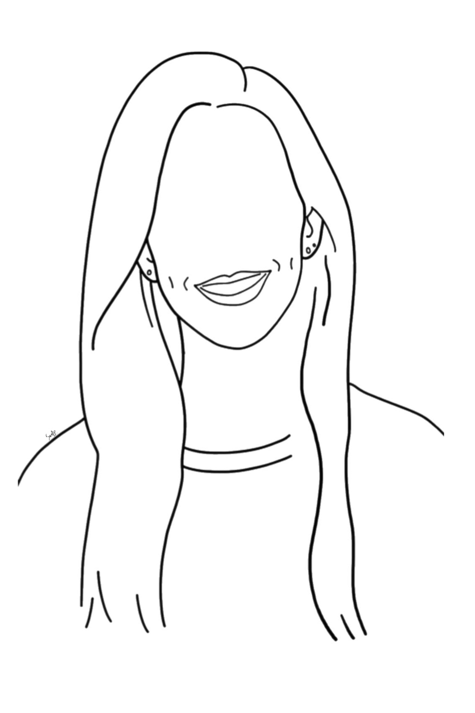
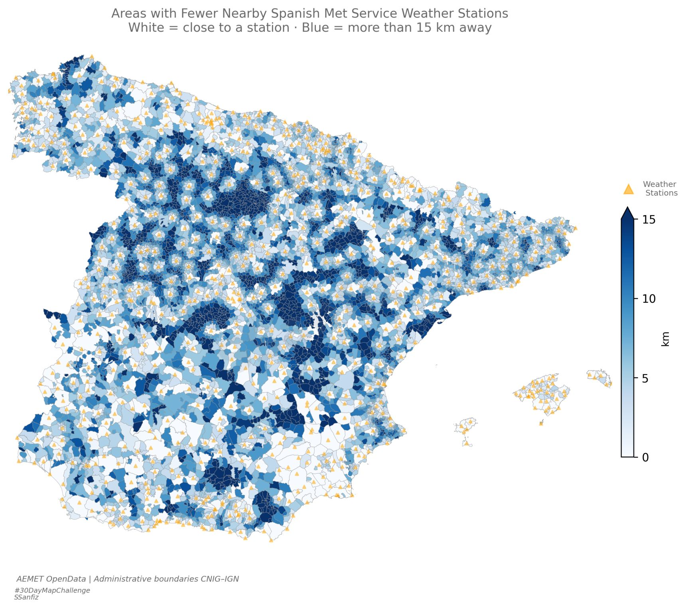
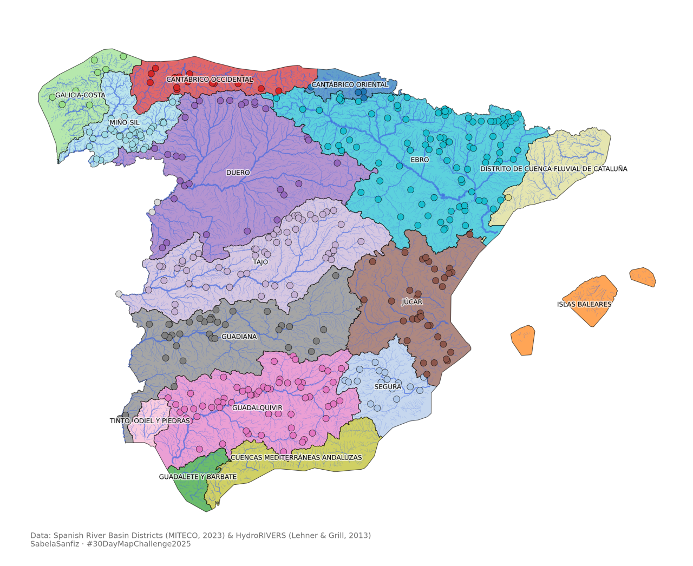
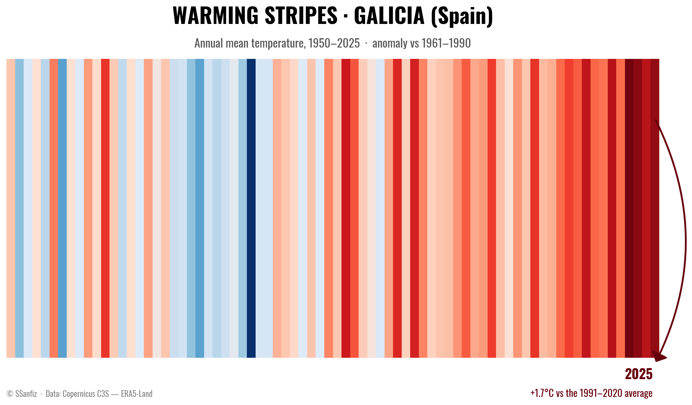

```{=html}
<script src="https://cdn.jsdelivr.net/npm/particles.js@2.0.0/particles.min.js"></script>

<div id="particles-js"></div>

<!-- ── HERO ── -->
<section id="hero" class="sp-hero">
  <div class="sp-hero-content">
    <p class="sp-hero-eyebrow">Climate Scientist · Dataviz Creator</p>
    <h1 class="sp-hero-name">Sabela Sanfiz</h1>
    <p class="sp-hero-sub">Hi! This is my portfolio, check it out.</p>
    <div class="sp-hero-links">
      <a href="#about" class="sp-btn-ghost">About me ↓</a>
      <a href="#work" class="sp-btn-solid">Explore work</a>
    </div>
  </div>
</section>

<!-- ── ABOUT ── -->
<section id="about" class="sp-section">
  <div class="sp-container">
    <p class="sp-label">// about</p>
    <h2 class="sp-section-title">Hi, I'm Sabela.</h2>
    <div class="sp-about-top">
      <div class="sp-about-text">
        <p>I am a <strong>Climate Scientist</strong> with over ten years of experience working with climate data, building visualisation products and communicating science in a meaningful way.</p>
        <p>My career has taken me from pure atmospheric research to interactive dashboards and science communication materials. That intersection, between rigorous science and engaging storytelling, is where I am happy to be.</p>
      </div>
      <div class="flip-poster" style="--r:-2deg;--tx:0px;--ty:4px" onclick="this.classList.toggle('is-flipped')">
        <div class="pin"></div>
        <div class="flip-poster-inner">
          <div class="flip-poster-front">
            
          </div>
          <div class="flip-poster-back">
            <p class="poster-back-title">Self-Portrait</p>
            <p class="poster-back-text">Created in Adobe Illustrator using an iPad.</p>
            <p class="poster-back-hint">← flip back</p>
          </div>
        </div>
      </div>
    </div>
  </div>
</section>

<!-- ── CV ── -->
<section id="cv" class="sp-section sp-section-alt">
  <div class="sp-container">
    <p class="sp-label">// cv</p>
    <h2 class="sp-section-title">Studies & Career</h2>
    <div class="cv-dual">

      <a href="cv-latex.pdf" download="cv-latex.pdf" class="cv-paper-link">
        <svg viewBox="30 20 220 400" xmlns="http://www.w3.org/2000/svg">
          <defs>
            <linearGradient id="pg" x1="0" y1="0" x2="0" y2="1"><stop offset="0%" stop-color="#ffffff"/><stop offset="100%" stop-color="#f4f4f4"/></linearGradient>
            <filter id="pshadow"><feDropShadow dx="0" dy="5" stdDeviation="7" flood-color="rgba(0,0,0,0.12)"/></filter>
          </defs>
          <style>
            .paper-g { animation: float-paper 3s ease-in-out infinite; transform-origin: 140px 165px; }
            @keyframes float-paper { 0%,100%{transform:translateY(0) rotate(-1.5deg)} 50%{transform:translateY(-10px) rotate(-0.5deg)} }
            .arrow-dl { animation: bounce-dl 1.1s ease-in-out infinite; }
            @keyframes bounce-dl { 0%,100%{transform:translateY(0);opacity:1} 50%{transform:translateY(6px);opacity:0.65} }
          </style>
          <g class="paper-g" filter="url(#pshadow)">
            <rect x="45" y="30" width="180" height="230" rx="4" fill="url(#pg)" stroke="#e0e0e0" stroke-width="1"/>
            <polygon points="205,30 225,30 225,50 205,50" fill="#e4e4e4" opacity="0.6"/>
            <polygon points="205,30 225,50 205,50" fill="#cccccc"/>
            <rect x="45" y="30" width="9" height="230" rx="2" fill="#182547"/>
            <circle cx="95" cy="75" r="18" fill="#dce8fd" stroke="#b2c5fc" stroke-width="1.5"/>
            <circle cx="95" cy="70" r="7" fill="#b2c5fc"/>
            <ellipse cx="95" cy="86" rx="12" ry="7" fill="#b2c5fc"/>
            <rect x="122" y="63" width="65" height="6" rx="3" fill="#0A102B" opacity="0.8"/>
            <rect x="122" y="74" width="48" height="4" rx="2" fill="#888" opacity="0.5"/>
            <rect x="122" y="82" width="38" height="3" rx="1.5" fill="#182547" opacity="0.35"/>
            <line x1="60" y1="106" x2="215" y2="106" stroke="#e8e8e8" stroke-width="1"/>
            <rect x="60" y="113" width="34" height="3" rx="1.5" fill="#182547" opacity="0.6"/>
            <rect x="60" y="120" width="145" height="3" rx="1.5" fill="#d0d0d0"/>
            <rect x="60" y="126" width="128" height="3" rx="1.5" fill="#d0d0d0"/>
            <rect x="60" y="132" width="138" height="3" rx="1.5" fill="#d0d0d0"/>
            <rect x="60" y="141" width="20" height="5" rx="2.5" fill="#182547" opacity="0.7"/>
            <rect x="84" y="141" width="20" height="5" rx="2.5" fill="#5a7de0" opacity="0.6"/>
            <rect x="108" y="141" width="20" height="5" rx="2.5" fill="#74c8a8" opacity="0.6"/>
            <line x1="60" y1="153" x2="215" y2="153" stroke="#e8e8e8" stroke-width="1"/>
            <rect x="60" y="159" width="46" height="3" rx="1.5" fill="#182547" opacity="0.6"/>
            <rect x="60" y="166" width="145" height="3" rx="1.5" fill="#d0d0d0"/>
            <rect x="60" y="172" width="118" height="3" rx="1.5" fill="#d0d0d0"/>
            <rect x="60" y="178" width="132" height="3" rx="1.5" fill="#d0d0d0"/>
            <line x1="60" y1="190" x2="215" y2="190" stroke="#e8e8e8" stroke-width="1"/>
            <rect x="60" y="196" width="40" height="3" rx="1.5" fill="#182547" opacity="0.6"/>
            <rect x="60" y="203" width="145" height="3" rx="1.5" fill="#d0d0d0"/>
            <rect x="60" y="209" width="108" height="3" rx="1.5" fill="#d0d0d0"/>
            <rect x="60" y="215" width="122" height="3" rx="1.5" fill="#d0d0d0"/>
          </g>
          <text x="140" y="288" text-anchor="middle" font-family="'Playfair Display',Georgia,serif" font-size="13" font-weight="700" fill="#0A102B">Download CV</text>
          <g class="arrow-dl">
            <rect x="133" y="296" width="13" height="17" rx="3" fill="#182547" opacity="0.85"/>
            <polygon points="120,311 160,311 140,328" fill="#182547" opacity="0.85"/>
          </g>
        </svg>
      </a>

      <a href="cv-career.html" class="cv-monitor-link">
        <svg viewBox="0 0 460 380" xmlns="http://www.w3.org/2000/svg">
          <defs>
            <linearGradient id="mg2" x1="0" y1="0" x2="0" y2="1"><stop offset="0%" stop-color="#1a2340"/><stop offset="100%" stop-color="#0A102B"/></linearGradient>
            <linearGradient id="dg2" x1="0" y1="0" x2="0" y2="1"><stop offset="0%" stop-color="#2a4a8a"/><stop offset="100%" stop-color="#182547"/></linearGradient>
            <filter id="mshadow"><feDropShadow dx="0" dy="5" stdDeviation="8" flood-color="rgba(0,0,0,0.15)"/></filter>
          </defs>
          <style>
            .mon-screen2 { transition: fill 0.3s; }
            .cta-rect2 { transition: fill 0.3s; }
            .cv-monitor-link:hover .mon-screen2 { fill: #e8f0fd; }
            .cv-monitor-link:hover .cta-rect2 { fill: #2a4a8a; }
            .pulse2 { animation: pulse2 2s ease-in-out infinite; }
            @keyframes pulse2 { 0%,100%{opacity:0.35} 50%{opacity:0.85} }
          </style>
          <rect x="10" y="10" width="440" height="240" rx="14" fill="url(#mg2)" filter="url(#mshadow)"/>
          <rect x="20" y="20" width="420" height="220" rx="9" class="mon-screen2" fill="#fafafa"/>
          <circle cx="42" cy="36" r="5" fill="#ff5f57"/>
          <circle cx="59" cy="36" r="5" fill="#febc2e"/>
          <circle cx="76" cy="36" r="5" fill="#28c840"/>
          <rect x="32" y="52" width="90" height="5" rx="2.5" fill="#182547" opacity="0.3"/>
          <rect x="32" y="61" width="150" height="4" rx="2" fill="#ccc" opacity="0.55"/>
          <rect x="32" y="69" width="130" height="4" rx="2" fill="#ccc" opacity="0.45"/>
          <rect x="32" y="77" width="110" height="4" rx="2" fill="#ccc" opacity="0.35"/>
          <rect x="70" y="104" width="320" height="66" rx="12" class="cta-rect2" fill="url(#dg2)"/>
          <text x="230" y="133" text-anchor="middle" font-family="'Playfair Display',Georgia,serif" font-size="16" font-weight="700" fill="white">Go to online CV</text>
          <text x="230" y="153" text-anchor="middle" font-family="monospace" font-size="10" fill="rgba(255,255,255,0.72)">click to explore →</text>
          <rect x="66" y="100" width="328" height="74" rx="15" fill="none" stroke="#182547" stroke-width="2" class="pulse2"/>
          <rect x="32" y="186" width="120" height="4" rx="2" fill="#ccc" opacity="0.3"/>
          <rect x="32" y="194" width="95" height="4" rx="2" fill="#ccc" opacity="0.22"/>
          <rect x="32" y="202" width="110" height="4" rx="2" fill="#ccc" opacity="0.18"/>
          <rect x="32" y="210" width="80" height="4" rx="2" fill="#ccc" opacity="0.14"/>
          <rect x="212" y="254" width="20" height="34" rx="3" fill="#0A102B"/>
          <rect x="182" y="284" width="80" height="11" rx="5" fill="#0A102B"/>
          <rect x="10" y="296" width="440" height="6" rx="3" fill="#0A102B" opacity="0.08"/>
        </svg>
      </a>

    </div>
  </div>
</section>


<!-- ── MILESTONES ── -->
<section id="milestones" class="sp-section">
  <div class="sp-container">
    <p class="sp-label">// milestones</p>
    <h2 class="sp-section-title">Milestones</h2>
    <p class="ms-intro">These are the projects I am most proud of. The ones that took the most time and most headaches. Pushed me furthest. Left the clearest mark on how I think about climate.</p>
    <div class="ms-grid">

      <a href="phd-thesis.html" class="ms-card">
        <p class="ms-card-title">PhD Thesis</p>
        <p class="ms-card-desc">Atmospheric and hydrological modelling of precipitation recycling and land–atmosphere interactions over Europe. European Doctorate Mention.</p>
        <span class="ms-card-cta">Read more →</span>
      </a>

      <a href="ucl.html" class="ms-card">
        <p class="ms-card-title">University College London</p>
        <p class="ms-card-desc">Palaeoclimate research at one of the world's top universities — simulating stalagmite growth to reconstruct past climates from cave proxy records.</p>
        <span class="ms-card-cta">Read more →</span>
      </a>

      <a href="marrisk.html" class="ms-card">
        <p class="ms-card-title">MarRISK Project</p>
        <p class="ms-card-desc">€3.5M European project assessing coastal climate risks for Galicia and Northern Portugal — flooding, erosion, extreme events and marine renewables.</p>
        <span class="ms-card-cta">Read more →</span>
      </a>

      <a href="seasonal-forecasting.html" class="ms-card">
        <p class="ms-card-title">Seasonal Forecasting</p>
        <p class="ms-card-desc">Climate services for Spain's national wetaher agency. Seasonal forecasts, interactive dashboards, geospatial analysis, congresses across Europe, a visiting stay in Germany.</p>
        <span class="ms-card-cta">Read more →</span>
      </a>

    </div>
  </div>
</section>

<!-- ── VISUALS ── -->
<section id="work" class="sp-section">
  <div class="sp-container">
    <p class="sp-label">// visuals</p>
    <h2 class="sp-section-title">Visuals</h2>
    <p class="sp-section-sub">Climate maps, data visualisations and animations made with Python. Click any image to explore.</p>
    <div class="work-carousel-wrap">
      <div class="work-carousel" id="work-track">

        <div class="work-item" onclick="openVisual(0)">
          <div class="work-img-wrap"></div>
          <p class="work-caption">Weather station coverage across Spain</p>
          <span class="work-type">Meteorology · Static map</span>
        </div>

        <div class="work-item" onclick="openVisual(1)">
          <div class="work-img-wrap"></div>
          <p class="work-caption">Spanish river basin districts with HydroRIVERS</p>
          <span class="work-type">Water · Static map</span>
        </div>

        <div class="work-item" onclick="openVisual(2)">
          <div class="work-img-wrap"></div>
          <p class="work-caption">European rivers</p>
          <span class="work-type">Water · Static map</span>
        </div>

        <div class="work-item" onclick="openVisual(3)">
          <div class="work-img-wrap">
            <video autoplay loop muted playsinline>
              <source src="images/visuals/co2-seaice.mp4" type="video/mp4"/>
            </video>
          </div>
          <p class="work-caption">CO₂ and sea ice extent</p>
          <span class="work-type">Climate Change · Animation</span>
        </div>

        <div class="work-item" onclick="openVisual(4)">
          <div class="work-img-wrap"></div>
          <p class="work-caption">Warming Stripes · Galicia (Spain)</p>
          <span class="work-type">Climate Change · Static chart</span>
        </div>

      </div>
      <button class="work-btn work-prev" onclick="scroll_work(-1)">&#8592;</button>
      <button class="work-btn work-next" onclick="scroll_work(1)">&#8594;</button>
    </div>
  </div>
</section>

<!-- ── VISUAL LIGHTBOX ── -->
<div class="vl-overlay" id="vl-overlay" onclick="closeVisual(event)">
  <button class="vl-nav vl-nav-prev" onclick="stepVisual(-1)">&#8592;</button>
  <div class="vl-panel" onclick="event.stopPropagation()">
    <button class="vl-close" onclick="closeVisual()">✕</button>
    <div class="vl-left" id="vl-left"></div>
    <div class="vl-right" id="vl-right"></div>
  </div>
  <button class="vl-nav vl-nav-next" onclick="stepVisual(1)">&#8594;</button>
</div>

<!-- ── CLIMATE ── -->
<section id="climate" class="sp-section sp-section-alt">
  <div class="sp-container">
    <p class="sp-label">// climate</p>
    <h2 class="sp-section-title">Climate & People</h2>
    <div class="sp-work-grid">
      <a href="ClimateArt.html" class="sp-work-card">
        <span class="sp-work-icon">🎨</span>
        <p class="sp-work-title">Climate & Art</p>
        <p class="sp-work-desc">Where climate science meets visual storytelling and design.</p>
        <span class="sp-work-cta">Explore →</span>
      </a>
      <a href="FemaleVoices.html" class="sp-work-card">
        <span class="sp-work-icon">🔬</span>
        <p class="sp-work-title">Female Voices</p>
        <p class="sp-work-desc">Pioneer women in climate science — stories history forgot.</p>
        <span class="sp-work-cta">Explore →</span>
      </a>
    </div>
  </div>
</section>

<!-- ── CONTACT ── -->
<section id="contact" class="sp-section">
  <div class="sp-container">
    <div class="sp-contact-grid">
      <div class="sp-contact-left">
        <p class="sp-label">// contact</p>
        <h2 class="sp-section-title">Let's talk.</h2>
        <div class="sp-contact-btns">
          <a href="mailto:sabelasanfiz@gmail.com" class="sp-btn-solid">Pop me an email</a>
        </div>
        <p>or give me a shout on social media :)</p>
        <div class="sp-social">
          <a href="https://www.linkedin.com/in/sabelasanfiz" target="_blank"><i class="bi bi-linkedin"></i></a>
          <a href="https://bsky.app/profile/sabelasanfiz.bsky.social" target="_blank"><i class="bi bi-cloud-fill"></i></a>
        </div>
      </div>
      <div class="sp-contact-right">
        <p class="sp-map-label">Based in A Coruña, Galicia · Northwest Spain</p>
        <div id="sp-map"></div>
      </div>
    </div>
  </div>
</section>

<link rel="stylesheet" href="https://unpkg.com/leaflet@1.9.4/dist/leaflet.css"/>
<script src="https://unpkg.com/leaflet@1.9.4/dist/leaflet.js"></script>

<style>
@import url('https://fonts.googleapis.com/css2?family=Playfair+Display:wght@400;700&family=DM+Sans:wght@300;400;500&display=swap');

#quarto-header, .navbar { display: none !important; }
body { margin: 0; padding: 0; background: #fafafa; }
#quarto-content, main.content, #quarto-document-content { margin: 0 !important; padding: 0 !important; max-width: 100% !important; }

#particles-js { position: fixed; inset: 0; width: 100%; height: 100%; z-index: 0; pointer-events: none; }
#particles-js canvas { pointer-events: none !important; }

.sp-hero { position: relative; z-index: 1; height: 100vh; min-height: 580px; display: flex; align-items: center; justify-content: center; overflow: hidden; background: transparent; }
.sp-hero-content { position: relative; z-index: 2; text-align: center; padding: 2rem; max-width: 700px; pointer-events: none; }
.sp-hero-content a { pointer-events: auto; }
.sp-hero-eyebrow { font-family: 'DM Sans', sans-serif; font-size: 0.75rem; letter-spacing: 0.18em; text-transform: uppercase; color: #182547; margin-bottom: 1rem; }
.sp-hero-name { font-family: 'Playfair Display', serif; font-size: clamp(2rem, 4.5vw, 3.5rem); font-weight: 700; line-height: 1.05; color: #0A102B; margin: 0 0 1.4rem 0; letter-spacing: -0.01em; }
.sp-hero-sub { font-family: 'DM Sans', sans-serif; font-size: 0.95rem; color: #556; line-height: 1.75; margin-bottom: 2.2rem; }
.sp-hero-links { display: flex; gap: 1rem; justify-content: center; flex-wrap: wrap; }

.sp-btn-solid { font-family: 'DM Sans', sans-serif; font-size: 0.8rem; letter-spacing: 0.08em; text-transform: uppercase; text-decoration: none; background: #182547; color: white !important; padding: 0.7rem 1.6rem; border-radius: 4px; transition: opacity 0.2s; display: inline-block; }
.sp-btn-solid:hover { opacity: 0.85; }
.sp-btn-ghost { font-family: 'DM Sans', sans-serif; font-size: 0.8rem; letter-spacing: 0.08em; text-transform: uppercase; text-decoration: none; border: 1px solid #182547; color: #182547 !important; padding: 0.7rem 1.6rem; border-radius: 4px; transition: background 0.2s, color 0.2s; display: inline-block; }
.sp-btn-ghost:hover { background: #182547; color: white !important; }

.sp-section { padding: 6rem 2rem; position: relative; z-index: 1; }
.sp-section-alt { background: rgba(250,250,250,0.82); }
.sp-container { max-width: 1000px; margin: 0 auto; }
.sp-label { font-family: monospace; font-size: 0.7rem; color: #182547; letter-spacing: 0.12em; margin-bottom: 0.5rem; display: block; }
.sp-section-title { font-family: 'Playfair Display', serif; font-size: clamp(1.8rem, 4vw, 2.8rem); color: #0A102B !important; margin: 0 0 1.2rem 0; font-weight: 700; }
.sp-section-sub { font-family: 'DM Sans', sans-serif; font-size: 0.88rem; color: #888; margin: 0 0 2rem 0; }

#quarto-document-content h1, #quarto-document-content h2, #quarto-document-content h3,
.sp-section-title, h1, h2, h3 { color: #0A102B !important; }

.sp-about-top { display: flex; gap: 1.5rem; align-items: flex-start; margin-bottom: 3rem; }
.sp-about-text { flex: 1; }
.sp-about-text p { font-family: 'DM Sans', sans-serif; font-size: 0.92rem; line-height: 1.8; color: #444; margin-bottom: 1rem; }

.flip-poster { width: 200px; flex-shrink: 0; height: 260px; perspective: 1000px; cursor: pointer; transform: rotate(var(--r)) translate(var(--tx), var(--ty)); transition: transform 0.3s ease; position: relative; }
.flip-poster:hover { transform: rotate(0deg) translateY(-4px); }
.flip-poster-inner { position: relative; width: 100%; height: 100%; transform-style: preserve-3d; transition: transform 0.7s ease; }
.flip-poster.is-flipped .flip-poster-inner { transform: rotateY(180deg); }
.flip-poster-front, .flip-poster-back { position: absolute; inset: 0; backface-visibility: hidden; -webkit-backface-visibility: hidden; border-radius: 6px; overflow: hidden; box-shadow: 2px 4px 16px rgba(0,0,0,0.15); }
.flip-poster-front img { width: 100%; height: 100%; object-fit: cover; }
.flip-poster-back { transform: rotateY(180deg); background: #f0f4ff; display: flex; flex-direction: column; align-items: center; justify-content: center; padding: 1.2rem; text-align: center; gap: 0.5rem; }
.poster-back-title { font-family: 'Playfair Display', serif; font-size: 1rem; font-weight: 700; color: #0A102B; }
.poster-back-text { font-size: 0.78rem; color: #666; line-height: 1.5; }
.poster-back-hint { font-size: 0.65rem; color: #182547; margin-top: 0.5rem; }
.pin { position: absolute; top: -10px; left: 50%; transform: translateX(-50%); width: 13px; height: 13px; background: radial-gradient(circle at 40% 35%, #f5c842, #c8960a); border-radius: 50%; z-index: 3; box-shadow: 0 2px 4px rgba(0,0,0,0.3); }

.cv-dual { display: grid; grid-template-columns: 1fr 1.6fr; gap: 1.5rem; align-items: center; }
.cv-paper-link, .cv-monitor-link { display: block; text-decoration: none; transition: transform 0.25s ease; }
.cv-paper-link svg { width: 100%; max-height: 320px; }
.cv-monitor-link svg { width: 100%; max-height: 320px; }
.cv-paper-link:hover { transform: translateY(-4px); }
.cv-monitor-link:hover { transform: translateY(-4px); }

.work-carousel-wrap { position: relative; margin-top: 1rem; }
.work-carousel { display: flex; gap: 2rem; overflow-x: auto; scroll-behavior: smooth; scrollbar-width: none; -ms-overflow-style: none; padding: 0 0 1.5rem 0; }
.work-carousel::-webkit-scrollbar { display: none; }
.work-item { flex: 0 0 auto; width: clamp(240px, 26vw, 360px); cursor: pointer; display: flex; flex-direction: column; gap: 0.5rem; }
.work-img-wrap { width: 100%; aspect-ratio: 4/3; overflow: hidden; background: #e8e8e8; }
.work-img-wrap img, .work-img-wrap video { width: 100%; height: 100%; object-fit: cover; display: block; transition: transform 0.5s ease; }
.work-item:hover .work-img-wrap img, .work-item:hover .work-img-wrap video { transform: scale(1.04); }
.work-caption { font-family: 'DM Sans', sans-serif; font-size: 0.88rem; color: #0A102B; margin: 0; font-weight: 500; }
.work-type { font-family: monospace; font-size: 0.66rem; color: #182547; letter-spacing: 0.08em; text-transform: uppercase; }
.work-btn { position: absolute; top: 38%; transform: translateY(-50%); background: white; border: 1px solid rgba(24,37,71,0.2); color: #0A102B; width: 42px; height: 42px; border-radius: 50%; font-size: 1rem; cursor: pointer; display: flex; align-items: center; justify-content: center; transition: background 0.2s, border-color 0.2s, color 0.2s; z-index: 10; box-shadow: 0 2px 8px rgba(0,0,0,0.08); }
.work-btn:hover { background: #182547; color: white; border-color: #182547; }
.work-prev { left: -22px; }
.work-next { right: -22px; }

/* ── Lightbox ── */
.vl-overlay { display: none; position: fixed; inset: 0; background: rgba(10,16,43,0.75); z-index: 9000; align-items: center; justify-content: center; padding: 2rem; backdrop-filter: blur(4px); }
.vl-overlay.open { display: flex; }
.vl-nav { position: relative; z-index: 10; flex-shrink: 0; background: rgba(255,255,255,0.12); border: 1px solid rgba(255,255,255,0.25); color: white; width: 48px; height: 48px; border-radius: 50%; font-size: 1.2rem; cursor: pointer; display: flex; align-items: center; justify-content: center; transition: background 0.2s; margin: 0 1rem; }
.vl-nav:hover { background: rgba(255,255,255,0.25); }
.vl-panel { position: relative; display: grid; grid-template-columns: 1fr 1fr; width: 100%; max-width: 1100px; max-height: 88vh; background: #fafafa; border-radius: 4px; overflow: hidden; box-shadow: 0 24px 80px rgba(0,0,0,0.35); animation: vlIn 0.25s ease; }
@keyframes vlIn { from { opacity:0; transform: scale(0.97); } to { opacity:1; transform: scale(1); } }
.vl-close { position: absolute; top: 1.2rem; right: 1.4rem; background: none; border: none; font-size: 1.3rem; color: #888; cursor: pointer; z-index: 10; line-height: 1; transition: color 0.2s; }
.vl-close:hover { color: #0A102B; }
.vl-left { background: #f0f0f0; display: flex; align-items: center; justify-content: center; overflow: hidden; max-height: 88vh; }
.vl-left img, .vl-left video { width: 100%; height: 100%; object-fit: contain; display: block; }
.vl-right { padding: 3rem 2.8rem; overflow-y: auto; display: flex; flex-direction: column; border-left: 1px solid rgba(24,37,71,0.08); }
.vl-label { font-family: monospace; font-size: 0.65rem; color: #182547; letter-spacing: 0.14em; text-transform: uppercase; margin: 0 0 0.6rem 0; }
.vl-title { font-family: 'Playfair Display', serif; font-size: clamp(1.3rem, 2.5vw, 1.9rem); font-weight: 700; color: #0A102B; margin: 0 0 1.8rem 0; line-height: 1.15; }
.vl-desc { font-family: 'DM Sans', sans-serif; font-size: 0.88rem; line-height: 1.82; color: #555; margin: 0 0 1rem 0; text-align: justify; }
.vl-callout { border-left: 3px solid #182547; background: rgba(24,37,71,0.04); border-radius: 0 4px 4px 0; padding: 0.9rem 1.1rem; margin: 0.6rem 0 1.4rem 0; }
.vl-callout p { font-family: 'DM Sans', sans-serif; font-size: 0.84rem; line-height: 1.72; color: #555; margin: 0; font-style: italic; }
.vl-link { display: inline-flex; align-items: center; gap: 0.4rem; font-family: 'DM Sans', sans-serif; font-size: 0.8rem; color: #182547 !important; text-decoration: none; margin: 0.2rem 0 1.6rem 0; transition: opacity 0.2s; }
.vl-link:hover { opacity: 0.7; }
.vl-meta { border-top: 1px solid rgba(24,37,71,0.1); padding-top: 1.2rem; margin-top: auto; display: flex; flex-direction: column; gap: 0.4rem; }
.vl-meta-row { display: flex; gap: 1rem; font-family: 'DM Sans', sans-serif; font-size: 0.78rem; color: #888; }
.vl-meta-row strong { color: #182547; font-weight: 600; font-size: 0.68rem; text-transform: uppercase; letter-spacing: 0.06em; min-width: 60px; }
.vl-download { display: inline-block; margin-top: 1.4rem; font-family: 'DM Sans', sans-serif; font-size: 0.75rem; font-weight: 500; letter-spacing: 0.08em; text-transform: uppercase; text-decoration: none; color: #182547 !important; border: 1px solid #182547; padding: 0.5rem 1.2rem; border-radius: 3px; transition: background 0.2s, color 0.2s; align-self: flex-start; }
.vl-download:hover { background: #182547; color: white !important; }


/* ── Milestones ── */
.ms-intro { font-family: 'DM Sans', sans-serif; font-size: 0.92rem; color: #666; line-height: 1.75; margin: 0 0 2.5rem 0; max-width: 680px; }
.ms-grid { display: grid; grid-template-columns: repeat(auto-fit, minmax(220px, 1fr)); gap: 1.2rem; }
.ms-card { display: flex; flex-direction: column; gap: 0.4rem; padding: 1.6rem 1.5rem; background: white; border: 1px solid rgba(24,37,71,0.12); border-radius: 8px; text-decoration: none; transition: transform 0.2s, box-shadow 0.2s, border-color 0.2s; }
.ms-card:hover { transform: translateY(-4px); box-shadow: 0 8px 28px rgba(24,37,71,0.1); border-color: #182547; }
.ms-card-tag { font-family: monospace; font-size: 0.66rem; color: #182547; letter-spacing: 0.1em; text-transform: uppercase; }
.ms-card-title { font-family: 'Playfair Display', serif; font-size: 1.05rem; font-weight: 700; color: #0A102B !important; margin: 0.2rem 0 0 0; }
.ms-card-org { font-family: 'DM Sans', sans-serif; font-size: 0.75rem; color: #888; margin: 0 0 0.5rem 0; }
.ms-card-desc { font-family: 'DM Sans', sans-serif; font-size: 0.82rem; color: #666; line-height: 1.55; margin: 0; flex: 1; }
.ms-card-cta { font-family: 'DM Sans', sans-serif; font-size: 0.72rem; color: #182547; margin-top: 0.8rem; }

.sp-work-grid { display: grid; grid-template-columns: repeat(auto-fit, minmax(210px, 1fr)); gap: 1.2rem; }
.sp-work-card { display: flex; flex-direction: column; gap: 0.5rem; padding: 1.6rem 1.4rem; background: white; border: 1px solid rgba(24,37,71,0.12); border-radius: 8px; text-decoration: none; transition: transform 0.2s, box-shadow 0.2s, border-color 0.2s; }
.sp-work-card:hover { transform: translateY(-4px); box-shadow: 0 8px 28px rgba(24,37,71,0.1); border-color: #182547; }
.sp-work-icon { font-size: 1.5rem; }
.sp-work-title { font-family: 'Playfair Display', serif; font-size: 1rem; color: #0A102B !important; margin: 0; font-weight: 700; }
.sp-work-desc { font-family: 'DM Sans', sans-serif; font-size: 0.8rem; color: #666; line-height: 1.5; margin: 0; flex: 1; }
.sp-work-cta { font-family: 'DM Sans', sans-serif; font-size: 0.72rem; color: #182547; margin-top: 0.4rem; }

.sp-contact-grid { display: grid; grid-template-columns: 1fr 1.3fr; gap: 4rem; align-items: start; }
.sp-contact-left p { font-family: 'DM Sans', sans-serif; font-size: 0.92rem; color: #666; line-height: 1.7; margin-bottom: 1.8rem; }
.sp-contact-btns { display: flex; gap: 0.8rem; flex-wrap: wrap; margin-bottom: 1.8rem; }
.sp-social { display: flex; gap: 1.2rem; }
.sp-social a { color: #888 !important; font-size: 1.1rem; text-decoration: none; transition: color 0.2s; }
.sp-social a:hover { color: #182547 !important; }
.sp-map-label { font-family: 'DM Sans', sans-serif; font-size: 0.75rem; color: #999; letter-spacing: 0.06em; margin-bottom: 0.8rem; text-transform: uppercase; }
#sp-map { height: 340px; border-radius: 10px; border: 1px solid rgba(24,37,71,0.15); overflow: hidden; box-shadow: 0 4px 20px rgba(24,37,71,0.08); }

@media (max-width: 750px) {
  .cv-dual { grid-template-columns: 1fr; }
  .cv-paper-link svg { max-width: 220px; margin: 0 auto; display: block; }
  .sp-about-top { flex-direction: column; gap: 2rem; }
  .sp-contact-grid { grid-template-columns: 1fr; gap: 2.5rem; }
  .sp-section { padding: 4rem 1.5rem; }
  .work-prev { left: -10px; }
  .work-next { right: -10px; }
  .work-item { width: 78vw; }
  .vl-panel { grid-template-columns: 1fr; max-height: 95vh; }
  .vl-left { max-height: 45vh; }
  .vl-right { padding: 1.5rem; }
}
</style>

<script>
const visuals = [
  {
    img: 'images/visuals/plot1.jpg', type: 'img',
    label: '// meteorology · static map',
    title: 'Weather Station Coverage across Spain',
    descs: [
      'Choropleth map showing the distance from each Spanish municipality to the nearest Spanish Met Service (AEMET) weather station. Areas in deep blue represent distances higher than 15 km from the closest station, revealing significant coverage gaps across the territory.',
      'In the context of climate change, extreme precipitation events, prolonged droughts, and heat episodes are becoming more frequent and more intense across the Iberian Peninsula. Some of the ability to monitor those events depends on whether there is a ground station.'
    ],
    callout: 'The lack of weather station coverage limits the ability to detect and anticipate extreme events. Without observations, there is no data assimilation — and forecast models are blind in precisely the areas that matter most.',
    linkedin: 'https://www.linkedin.com/feed/update/urn:li:activity:7392484571314798592/',
    meta: [
      { label: 'Tools', value: 'Python · GeoPandas · Matplotlib' },
      { label: 'Context', value: '#30DayMapChallenge 2025 · Day 7: Accessibility' },
      { label: 'Data', value: 'AEMET OpenData · CNIG-IGN' }
    ],
    download: 'images/visuals/plot1.jpg', downloadName: 'weather-stations-spain.jpg'
  },
  {
    img: 'images/visuals/plot2.png', type: 'img',
    label: '// water · static map',
    title: 'Spanish River Basin Districts',
    descs: [
      "Map of Spain's 16 river basin districts overlaid with the HydroRIVERS dataset. Each basin is coloured independently, with river networks drawn at varying widths according to stream order."
    ],
    callout: null,
    linkedin: 'https://www.linkedin.com/feed/update/urn:li:activity:7390748369809289216/',
    meta: [
      { label: 'Tools', value: 'Python · GeoPandas · Matplotlib' },
      { label: 'Context', value: '#30DayMapChallenge 2025 · Rivers' },
      { label: 'Data', value: 'MITECO · HydroRIVERS' }
    ],
    download: 'images/visuals/plot2.png', downloadName: 'spanish-river-basins.png'
  },
  {
    img: 'images/visuals/rivers_europe_minimal.png', type: 'img',
    label: '// water · static map',
    title: 'European Rivers',
    descs: [
      'A minimal cartographic rendering of the entire European river network using the HydroRIVERS dataset. No political boundaries — only the river lines, drawn at varying widths according to stream order.'
    ],
    callout: null, linkedin: null,
    meta: [
      { label: 'Tools', value: 'Python · GeoPandas · Matplotlib' },
      { label: 'Context', value: '#30DayMapChallenge 2025 · Minimal' },
      { label: 'Data', value: 'HydroRIVERS (Lehner & Grill, 2013)' }
    ],
    download: 'images/visuals/rivers_europe_minimal.png', downloadName: 'rivers-europe.png'
  },
  {
    img: 'images/visuals/co2-seaice.mp4', type: 'video',
    label: '// climate change · animation',
    title: 'CO₂ and Sea Ice Extent',
    descs: [
      'Each frame in this animation is a pair of 3D bubbles growing and shrinking through time to make two opposing trends visible. The red bubble tracks atmospheric CO₂ concentration: it grows relentlessly. The blue bubble tracks Arctic sea ice extent: it shrinks.',
      'CO₂ has risen from around 315 ppm in the late 1950s to over 420 ppm today. Over the same period, Arctic sea ice has lost roughly 13% of its extent per decade.'
    ],
    callout: 'These are not independent signals — they are two sides of the same story.',
    linkedin: 'https://www.linkedin.com/feed/update/urn:li:activity:7392306809266483200/',
    meta: [
      { label: 'Tools', value: 'Python · Matplotlib · PyVista' },
      { label: 'Context', value: 'Climate communication · Personal project' },
      { label: 'Data', value: 'NOAA (Mauna Loa CO₂) · Copernicus Marine' }
    ],
    download: 'images/visuals/co2-seaice.mp4', downloadName: 'co2-seaice.mp4'
  },
  {
    img: 'images/visuals/01_warming_stripes_galicia.png', type: 'img',
    label: '// climate change · static chart',
    title: 'Warming Stripes · Galicia (Spain)',
    descs: [
      'Annual mean temperature anomalies for Galicia from 1950 to 2025, visualised as warming stripes — each bar one year, coloured from deep blue (cooler than average) to dark red (warmer than average). The reference period is 1961–1990.',
      '2025 stands at +1.7°C above the 1991–2020 average, making it the warmest year on record for the region. The shift from blue to red across the chart is not gradual — it accelerates.'
    ],
    callout: 'Galicia is often perceived as the cool, wet corner of the Iberian Peninsula. These stripes tell a different story: warming here is real, measurable, and accelerating.',
    linkedin: 'https://www.linkedin.com/feed/update/urn:li:activity:7474129344634892288/',
    meta: [
      { label: 'Tools', value: 'Python · PyPalettes · DrawArrow · PyFonts' },
      { label: 'Libraries', value: 'Joseph Barbier — github.com/y-sunflower' },
      { label: 'Data', value: 'Copernicus C3S — ERA5-Land' }
    ],
    download: 'images/visuals/01_warming_stripes_galicia.png', downloadName: 'warming-stripes-galicia.png'
  }
];

let currentVisualIndex = 0;

function stepVisual(dir) {
  currentVisualIndex = (currentVisualIndex + dir + visuals.length) % visuals.length;
  openVisual(currentVisualIndex);
}

function openVisual(i) {
  currentVisualIndex = i;
  const v = visuals[i];
  const left = document.getElementById('vl-left');
  const right = document.getElementById('vl-right');

  left.innerHTML = v.type === 'video'
    ? `<video autoplay loop muted playsinline style="width:100%;height:100%;object-fit:contain;display:block;"><source src="${v.img}" type="video/mp4"/></video>`
    : ``;

  const calloutHTML = v.callout ? `<div class="vl-callout"><p>${v.callout}</p></div>` : '';
  const linkedinHTML = v.linkedin ? `<a href="${v.linkedin}" target="_blank" class="vl-link"><svg xmlns="http://www.w3.org/2000/svg" width="13" height="13" fill="currentColor" viewBox="0 0 16 16"><path d="M0 1.146C0 .513.526 0 1.175 0h13.65C15.474 0 16 .513 16 1.146v13.708c0 .633-.526 1.146-1.175 1.146H1.175C.526 16 0 15.487 0 14.854zm4.943 12.248V6.169H2.542v7.225zm-1.2-8.212c.837 0 1.358-.554 1.358-1.248-.015-.709-.52-1.248-1.342-1.248S2.4 3.226 2.4 3.934c0 .694.521 1.248 1.327 1.248zm4.908 8.212V9.359c0-.216.016-.432.08-.586.173-.431.568-.878 1.232-.878.869 0 1.216.662 1.216 1.634v3.865h2.401V9.25c0-2.22-1.184-3.252-2.764-3.252-1.274 0-1.845.7-2.165 1.193v.025h-.016l.016-.025V6.169h-2.4c.03.678 0 7.225 0 7.225z"/></svg> Original LinkedIn post</a>` : '';
  const metaHTML = v.meta.map(m => `<div class="vl-meta-row"><strong>${m.label}</strong><span>${m.value}</span></div>`).join('');

  right.innerHTML = `
    <p class="vl-label">${v.label}</p>
    <h2 class="vl-title">${v.title}</h2>
    ${v.descs.map(d => `<p class="vl-desc">${d}</p>`).join('')}
    ${calloutHTML}
    ${linkedinHTML}
    <div class="vl-meta">${metaHTML}</div>
    <a href="${v.download}" download="${v.downloadName}" class="vl-download">↓ Download</a>
  `;

  document.getElementById('vl-overlay').classList.add('open');
  document.body.style.overflow = 'hidden';
}

function closeVisual(e) {
  if (e && e.target !== document.getElementById('vl-overlay')) return;
  document.getElementById('vl-overlay').classList.remove('open');
  document.body.style.overflow = '';
}

document.addEventListener('keydown', e => {
  if (e.key === 'Escape') { document.getElementById('vl-overlay').classList.remove('open'); document.body.style.overflow = ''; }
  if (e.key === 'ArrowRight') stepVisual(1);
  if (e.key === 'ArrowLeft') stepVisual(-1);
});

function scroll_work(dir) {
  const track = document.getElementById('work-track');
  const item = track.querySelector('.work-item');
  track.scrollBy({ left: dir * (item.offsetWidth + 32), behavior: 'smooth' });
}

window.addEventListener('load', function() {
  const pDiv = document.getElementById('particles-js');
  if (pDiv) {
    pDiv.style.pointerEvents = 'none';
    document.body.appendChild(pDiv);
  }

  particlesJS('particles-js', {
    particles: {
      number: { value: 80, density: { enable: true, value_area: 800 } },
      color: { value: '#182547' },
      shape: { type: 'circle' },
      opacity: { value: 0.6, random: true },
      size: { value: 5, random: true },
      line_linked: { enable: true, distance: 150, color: '#182547', opacity: 0.4, width: 1.5 },
      move: { enable: true, speed: 2, direction: 'none', random: true, straight: false, out_mode: 'out', bounce: false }
    },
    interactivity: {
      detect_on: 'canvas',
      events: { onhover: { enable: true, mode: 'repulse' }, onclick: { enable: true, mode: 'push' }, resize: true },
      modes: { repulse: { distance: 120, duration: 0.4 }, push: { particles_nb: 4 } }
    },
    retina_detect: true
  });

  document.querySelectorAll('a[href^="#"]').forEach(a => {
    a.addEventListener('click', e => {
      const target = document.querySelector(a.getAttribute('href'));
      if (target) { e.preventDefault(); target.scrollIntoView({ behavior: 'smooth', block: 'start' }); }
    });
  });

  const map = L.map('sp-map', { center: [50, 5], zoom: 4, zoomControl: true, scrollWheelZoom: false });
  L.tileLayer('https://{s}.basemaps.cartocdn.com/light_all/{z}/{x}/{y}{r}.png', { attribution: '© OpenStreetMap © CARTO', subdomains: 'abcd', maxZoom: 19 }).addTo(map);
  const icon = L.divIcon({ html: '<div style="width:12px;height:12px;background:#182547;border:3px solid white;border-radius:50%;box-shadow:0 2px 8px rgba(24,37,71,0.5)"></div>', className: '', iconAnchor: [6, 6] });
  L.marker([43.3623, -8.4115], { icon }).addTo(map).bindPopup('<b>A Coruña</b><br>Galicia, Spain').openPopup();
});
</script>
```
