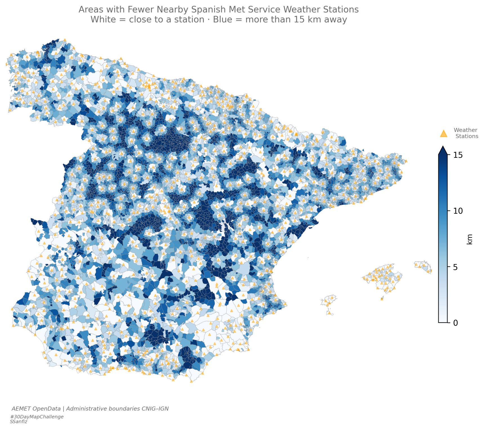

```{=html}
<div class="visual-detail">

  <a href="../Maps.html" class="back-link">← Back to maps</a>

  <h2 class="visual-title">Weather Station Coverage across Spain</h2>

  <div class="visual-detail-media">
    
  </div>

    <div class="visual-download">
      <a href="../images/visuals/plot1.jpg" download="weather-stations-spain.jpg" class="download-btn">
        ↓ download map
      </a>
    </div>

  <div class="visual-meta">

    <p class="visual-desc">Choropleth map showing the distance from each Spanish municipality to the nearest Spanish Met Service (AEMET) weather station. Areas in deep blue represent distances higher than 15 km from the closest station, revealing significant coverage gaps across the territory.</p>

    <p class="visual-desc">The information behind this map is the gaps in Spain’s weather-observation network, particularly in rural and mountainous areas, where investment in climate infrastructure has historically been low. Those gaps are not merely cartographic, they have real consequences.</p>

    <div class="callout">
      <p>The lack of weather station coverage limits the ability to detect and anticipate extreme events such as heatwaves, heavy rainfall, and storms. Without observations, there is no data assimilation. Without data assimilation, forecast models are blind in precisely the areas that matter most during high-impact events.</p>
    </div>

    <p class="visual-desc">In the context of climate change, this is not a minor technical detail. Extreme precipitation events, prolonged droughts, and heat episodes are becoming more frequent and more intense across the Iberian Peninsula. Some of the ability to monitor those events depends on whether there is a ground station.</p>

    <p class="visual-link-row">
      <a href="https://www.linkedin.com/feed/update/urn:li:activity:7392484571314798592/" target="_blank" class="visual-ext-link">
        <svg xmlns="http://www.w3.org/2000/svg" width="14" height="14" fill="currentColor" viewBox="0 0 16 16" style="vertical-align:-2px; margin-right:5px;"><path d="M0 1.146C0 .513.526 0 1.175 0h13.65C15.474 0 16 .513 16 1.146v13.708c0 .633-.526 1.146-1.175 1.146H1.175C.526 16 0 15.487 0 14.854zm4.943 12.248V6.169H2.542v7.225zm-1.2-8.212c.837 0 1.358-.554 1.358-1.248-.015-.709-.52-1.248-1.342-1.248S2.4 3.226 2.4 3.934c0 .694.521 1.248 1.327 1.248zm4.908 8.212V9.359c0-.216.016-.432.08-.586.173-.431.568-.878 1.232-.878.869 0 1.216.662 1.216 1.634v3.865h2.401V9.25c0-2.22-1.184-3.252-2.764-3.252-1.274 0-1.845.7-2.165 1.193v.025h-.016l.016-.025V6.169h-2.4c.03.678 0 7.225 0 7.225z"/></svg>
        Original LinkedIn post
      </a>
    </p>

    <table class="visual-info">
      <tr><td class="meta-label">Tools</td><td>Python · GeoPandas · Matplotlib</td></tr>
      <tr><td class="meta-label">Context</td><td>#30DayMapChallenge 2025 · Day 7: Accessibility</td></tr>
      <tr><td class="meta-label">Data</td><td>AEMET OpenData · Administrative boundaries CNIG-IGN</td></tr>
    </table>

  </div>

</div>

<style>
.visual-detail {
  max-width: 780px;
  margin: 0 auto;
  padding: 1.5rem 1rem 3rem 1rem;
}
.back-link {
  display: inline-block;
  margin-bottom: 2rem;
  font-size: 0.82rem;
  font-weight: 600;
  letter-spacing: 0.04em;
  text-decoration: none;
  color: var(--mustard) !important;
  transition: opacity 0.2s;
}
.back-link:hover { opacity: 0.7; }
.visual-title {
  font-size: 1.5rem;
  font-weight: 700;
  color: #1a1a1a !important;
  margin-bottom: 1.5rem;
  line-height: 1.3;
}
.visual-detail-media img,
.visual-detail-media video {
  width: 100%;
  border-radius: 10px;
  box-shadow: 0 4px 16px rgba(0,0,0,0.10);
  display: block;
}
.visual-meta {
  margin-top: 1.8rem;
}
.visual-desc {
  font-size: 0.95rem;
  line-height: 1.75;
  color: #444;
  margin-bottom: 1.2rem;
  text-align: justify;
}

.visual-download { margin-top: 0.8rem; text-align: right; }
.download-btn {
  font-size: 0.78rem; font-weight: 600; text-transform: uppercase;
  color: var(--mustard); border: 1px solid var(--mustard);
  padding: 0.35rem 0.9rem; border-radius: 4px;
}
.download-btn:hover { background: var(--mustard); color: #fff; }

/* ── Callout ─────────────────────────────────────────── */
.callout {
  border-left: 3px solid var(--mustard);
  background: color-mix(in srgb, var(--mustard) 6%, white);
  border-radius: 0 6px 6px 0;
  padding: 0.9rem 1.2rem;
  margin: 1.4rem 0;
}
.callout p {
  font-size: 0.92rem;
  line-height: 1.7;
  color: #444;
  margin: 0;
  font-style: italic;
}

/* ── External link ───────────────────────────────────── */
.visual-link-row {
  margin: 1.4rem 0 1rem 0;
}
.visual-ext-link {
  display: inline-flex;
  align-items: center;
  font-size: 0.82rem;
  font-weight: 600;
  color: var(--mustard) !important;
  text-decoration: none;
  transition: opacity 0.2s;
}
.visual-ext-link:hover { opacity: 0.7; }

/* ── Meta table ──────────────────────────────────────── */
.visual-info {
  border: none;
  width: 100%;
  font-size: 0.88rem;
  border-top: 1px solid #eee;
  margin-top: 0.5rem;
}
.visual-info tr {
  border-bottom: 1px solid #f4f4f4;
}
.visual-info td {
  padding: 0.5rem 0.8rem 0.5rem 0;
  border: none;
  vertical-align: top;
  color: #555;
}
.meta-label {
  font-weight: 600;
  color: #aaa;
  white-space: nowrap;
  width: 80px;
  font-size: 0.78rem;
  text-transform: uppercase;
  letter-spacing: 0.06em;
}
</style>
```
